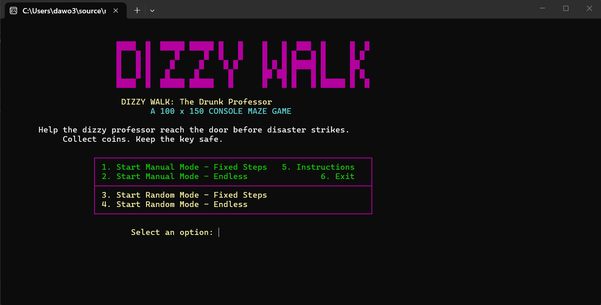
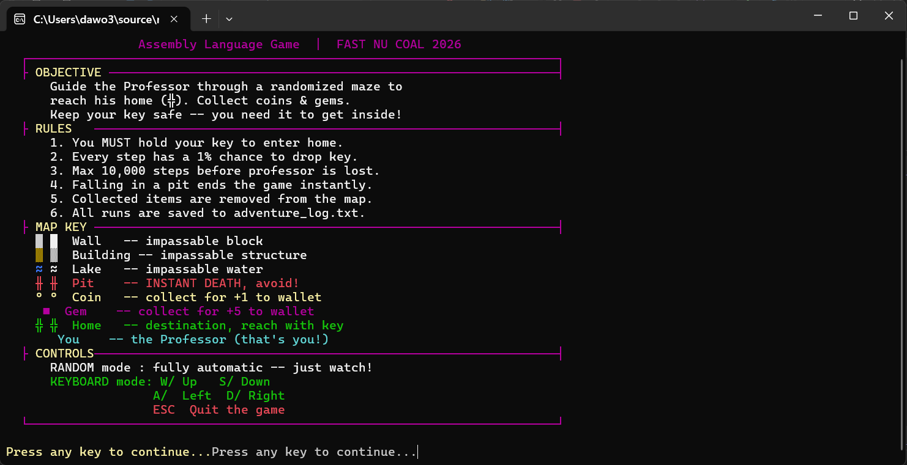
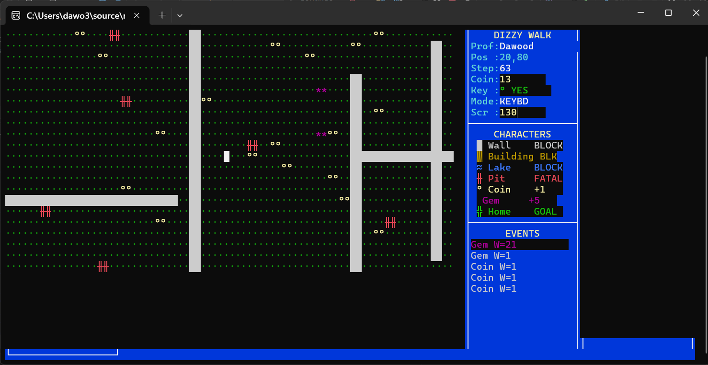
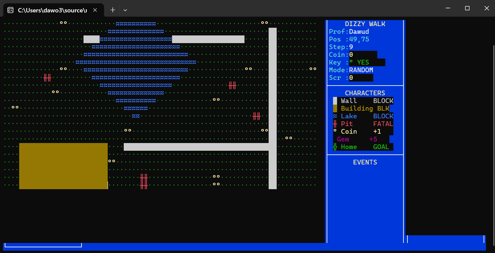
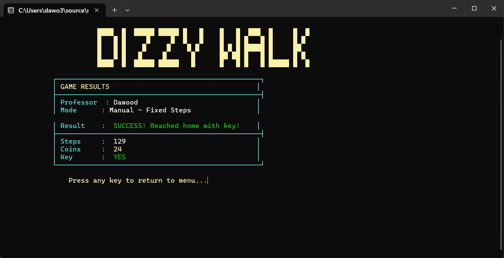

# Dizzy Walk - Assembly Maze Adventure Game

An interactive maze adventure game developed in x86 Assembly Language as part of the Computer Organization and Assembly Language (COAL) course at FAST NUCES Islamabad.

The project simulates a professor navigating through a large maze while collecting treasures, avoiding hazards, and reaching the destination. The game demonstrates low-level programming concepts including macros, procedures, structures, file handling, memory management, and console-based visual simulation.

---

## Contributors

- UmeHani Awais
- Maidah Binte Junaid
- Muhammad Dawood

---

## Features

- Large maze-based adventure environment
- Manual navigation mode
- Random movement simulation mode
- Coin and gem collection system
- Pit and obstacle handling
- Key-based progression mechanics
- Adventure event logging
- Statistics tracking
- File handling and report generation
- Colorful console visualization
- Sound effects and interactive gameplay

---

## Technologies Used

- x86 Assembly Language
- Irvine32 Library
- MASM
- Windows Console Programming

---

## Learning Outcomes

This project provided practical experience with:

- Assembly Language Programming
- Low-Level Memory Management
- Procedures and Macros
- Structures and Data Organization
- File Input/Output Operations
- Event Logging Systems
- Game Logic Design
- Debugging Large Assembly Projects

---

## Screenshots

### Main Menu

### Instructions Screen

### Manual Navigation Mode

### Random Navigation Mode

### Results Screen

Checkout the screenshots folder to see more screenshots of the game.
---

## Video Demonstration

▶ **Project Demonstration Video**

[(https://www.linkedin.com/posts/muhammad-dawood-a1bb40324_excited-to-share-another-project-as-part-activity-7473100160089317376-pW0_?utm_source=share&utm_medium=member_desktop&rcm=ACoAAFIJzbcBieJ-zMHfKZuyZR2F1OKolg5Yk8k)]

---

## Project Overview

The objective of the game is to guide the professor through a maze environment while collecting valuable items and avoiding hazards. The player can either manually control movement or allow the system to simulate random navigation. Throughout the adventure, events are recorded in log files, allowing the complete journey to be reviewed after execution.

This project showcases how complex interactive applications can be developed using Assembly Language through modular design and low-level programming techniques.

---

## Future Improvements

* Additional Levels
* More Boss Battles
* Enhanced Visual Effects
* Improved Animations
* Additional Weapons
* Expanded Enemy Variety

---

## Author

Muhammad Dawood | 
Maidah BInte Junaid | 
UmeHani Awais | 
BS Cyber Security | 
FAST NUCES Islamabad

GitHub: https://github.com/Dawood3838
